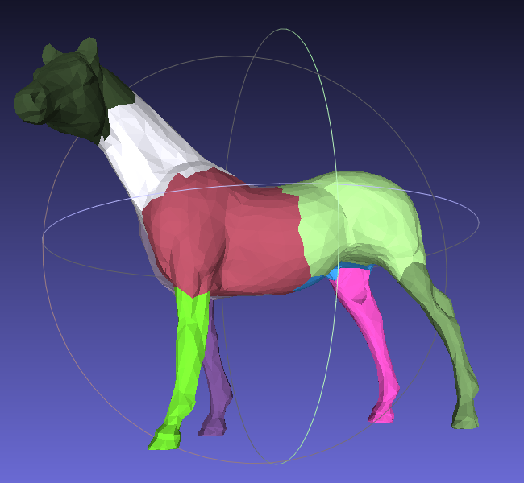
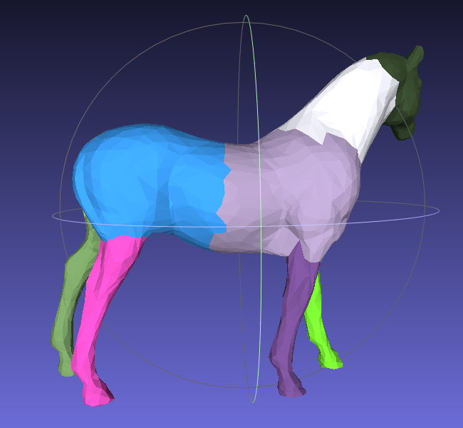
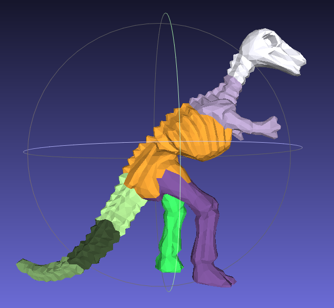

# Mesh Segmentation

python实现[***Hierarchical Mesh Decomposition using Fuzzy Clustering and Cuts***](https://dl.acm.org/doi/pdf/10.1145/882262.882369):

- 用python和numpy实现，代码简洁
- 层次化k路分解
- 中文注释帮助理解
- 最短路算法cython加速
- 图形学课程作业

效果
----------------------

<p float="left">
  
   
</p>


<p float="left">
  
   
</p>


运行
----------------------
安装依赖：
``` bash
pip install -r requirements.txt
```
cython编译：
``` bash
python setup.py build_ext --inplace
```
运行：
``` bash
python main.py
```

ply格式输入和输出可以用[MeshLab](https://www.meshlab.net/#download)查看。

原理与代码结构
----------------------

> 圆括号内表示main.py源码中对应的函数

* 读入模型，算出面片的邻接信息【权值计算】`（compute_neighbor，compute_dis）`；
* Dijkstra算法算出面片两两间的最短距离【最短距离计算】`（compute_shortest）`；
* k路分解`（seg）`；
  * 根据G函数确定k值和k个初始种子【种子生成】`（k_way_reps）`；
  * 计算每个面片i分到第k类的概率值【概率计算】`（compute_prob）`，用清晰区域划分信息、概率值和距离值重新计算k个种子【种子更新】`（recompute_reps，assign）`；循环直到不再变化；
  * 用最终的概率值对清晰区域进行划分【区域划分: 清晰部分】`（assign）`；
  * 对每两类的模糊区域计算最大流（源类→模糊区域→汇类），Ford-Fulkerson增广路算法中BFS搜到的部分为源类，其余为汇类【区域划分: 模糊部分】`（assign_fuzzy，compute_flow）`；
  * 对不满足结束条件的子模型进行k路分解【层次化】。

参考文献
----------------------
Katz S, Tal A. Hierarchical mesh decomposition using fuzzy clustering and cuts[J]. ACM transactions on graphics (TOG), 2003, 22(3): 954-961.

学术诚信
----------------------
课程作业，谨慎参考。如果你在作业中参考了此实现，可在作业报告中说明。
