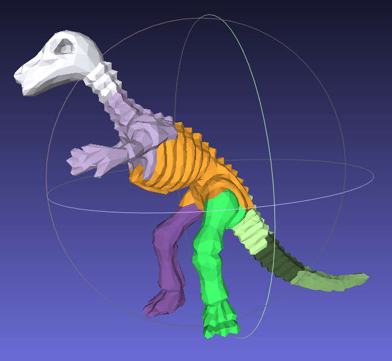

## Mesh Segmentation
python版本的***Hierarchical Mesh Decomposition using Fuzzy Clustering and Cuts***实现：

- **用python和numpy实现，代码简洁**
- **层次化k路/2路分解**
- **中文注释帮助理解**
- **最短路算法cython加速**
- **某课程作业**

#### 效果

<p float="left">
  
   
</p>


<p float="left">
  
   
</p>


#### 运行
安装依赖：
``` bash
pip install -r requirements.txt
```
编译cython：
``` bash
python setup.py build_ext --inplace
```
运行：
``` bash
python main.py
```

结果文件可以用MeshLab查看。

#### 原理与代码结构

> ()内表示代码中相对应的函数

* 读入模型，算出面片的邻接信息【权值计算】`（compute_neighbor，compute_dis）`；
* Dijkstra算法算出面片两两间的最短距离【最短距离计算】`（compute_shortest）`；
* k路分解`（seg）`；
  * 根据G函数确定k值和k个初始种子【种子生成】`（k_way_reps）`；
  * 计算每个面片i分到第k类的概率值【概率计算】`（compute_prob）`；按概率值分配到k类或模糊区域【区域划分: 清晰部分】`（assign）`，并重新计算k个种子【种子更新】`（recompute_reps）`；循环直到不再变化；
  * 对每两类的模糊区域计算最大流（源类→模糊区域→汇类），Ford-Fulkerson增广路算法中BFS搜到的部分为源类，其余为汇类【区域划分: 模糊部分】`（assign_fuzzy，compute_flow）`；
  * 对不满足结束条件的子模型进行k路分解【层次化】。

